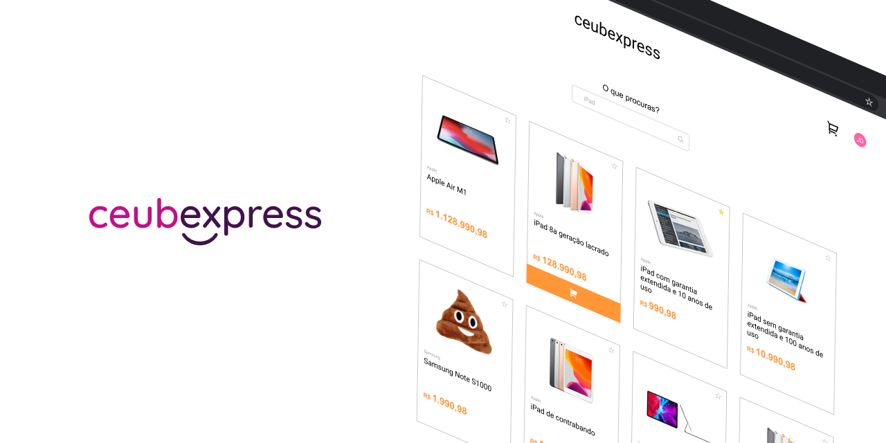

# CEUBEXPRESS Marketplace

[CEUBEXPRESS](#) is a lightweight and minimalist marketplace purely built in ReactJS.

## Table of content

- [Information](#information)
- [Installation](#installation)
- [Development](#development)
  - [Database](#database)
  - [Styling](#styling)
  - [CMS](#cms)
  - [ReactJS](#react)
  - [NodeJS](#node)

## Information
This is part of a final paper for a Software Engineering class in the University Center of Brasilia. The group is composed by Vitor, Thalles, Vinicius and Wallace.

#### [Try out our live demo](#https://)

## Installation

## Development
### Database
### Styling
### CMS
### React
### Node
  
